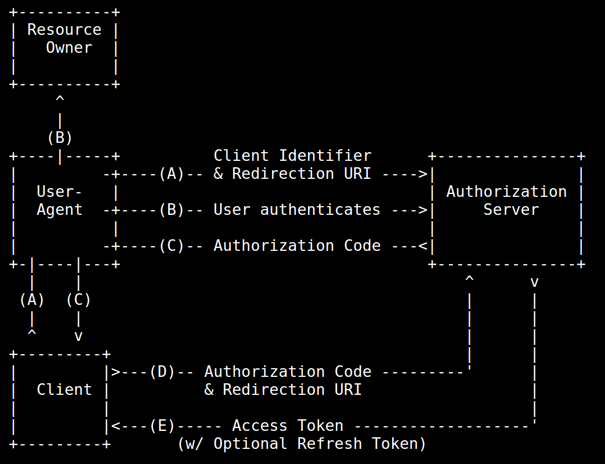

# Charla JASYP 2019

Charla sobre OAuth en [JASYP-2019](https://interferencias.tech/jasyp/)

### Notas

#### ¿Qué problemas intenta solucionar OAuth 2.0?

- Seguridad de APIs:
  - Autenticar a los consumidores de las APIs y establecer un nivel de confianza asociado a cada uno de ellos.
  - Solicitar la autorización explícita de los consumidores para ejecutar ciertas tareas.
  - Disponer de herramientas que rastreen las peticiones de forma end-to-end que permitan identificar todas las partes involucradas.
- Intercambio de contraseñas.
- Delegación de autorización para acceder a los datos.

#### ¿Qué es OAuth 2.0?

Es un framework de autorización flexible que describe algunos métodos (grants) para que una aplicación cliente pueda adquirir un `access token` (que representa el permiso del usuario para que la aplicación acceda a sus datos) que puede ser usado para autenticar una petición a un API endpoint.

Estándar que permite a las aplicaciones un acceso limitado (scopes) a los datos de los usuarios, sin tener que proporcionar las credenciales de dicho usuario, desacoplando la autenticación y la autorización a los datos.

### Glosario

- Resource owner (el usuario): una entidad capaz de conceder acceso a un recurso protegido. Si es una persona, se le llama end-user o usuario final.
- Resource server (la API): el servidor hosteando los recursos protegidos. Capaz de aceptar y responder a peticiones a recursos protegidos usando access tokens.
- Client: una aplicación haciendo peticiones a recursos protegidos en nombre del resource owner y con su autorización.
- Authorization server: el servidor que genera los access tokens para el cliente después de autenticar al resource owner y obtener autorización.
- First party: cliente en el que confías lo suficiente como para que gestione la autorización.
- Third party: cliente en el que no confías lo suficiente como para que gestione la autorización.

### CSRF Attack

CSRF (cross-site request forgery, one-click attack o session riding) es un tipo de exploit malicioso donde comandos no autorizados son transmitidos desde un usuario a una aplicación web que confía en el usuario.

### Authorization code grant

#### Parte 1

- `audience`: (opcional, usado sólo por algunos servidores de autorización como Auth0) identificador de la API a la que la aplicación quiere acceder.
- `scope`: valores separados por espacios que representa qué permisos tendrá el token. Pueden ser cualquiera de [standard OIDC scopes](https://openid.net/specs/openid-connect-core-1_0.html#StandardClaims) o customs.
- `response_type`: determina qué va a devolver el servidor de autorización.
- `client_id`: ID de la aplicación cliente.
- `state`: Valor opaco para evitar ataques [CSRF](https://auth0.com/docs/protocols/oauth2/oauth-state#redirect-users).
- `redirect_uri`: url a la que el servidor de autorización te redigirá después de haber obtenido autorización.

Ejemplo de request:

```
				https://YOUR_DOMAIN/authorize?
				audience=YOUR_API_AUDIENCE&
				scope=YOUR_SCOPE&
				response_type=code&
				client_id=YOUR_CLIENT_ID&
				redirect_uri=https://YOUR_APP/callback&
				state=YOUR_OPAQUE_VALUE
```

Todos estos parámetros serán validados por el authorization server y aprovados por el cliente.

Si el usuario le concede acceso al cliente serán redirigidos a la url especificada con los siguientes parámetros:

- `code`: con el código de autorización
- `state`: con el mismo valor que antes le habíamos dado.

#### Parte 2

El cliente ahora hace una petición POST al servidor de autorización con los siguientes parámetros:

- `grant_type`: con el valor `authorization_code`
- `client_id`
- `client_secret`
- `redirect_uri`: la especificada anteriormente
- `code`: código del query string.

Y el servidor de autorización responderá con un objeto JSON conteniendo:

- `token_type`: normalmente Bearer
- `expires_in`: entero representando el TTL.
- `access_token`
- `refresh_token`: token para regenerar el `access_token` cuando expire.

Ejemplo visual:


